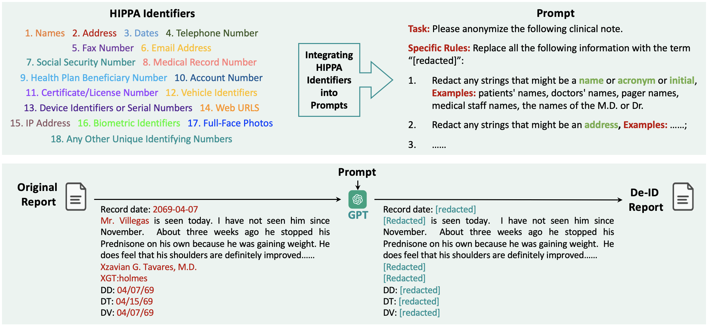

# DeID-GPT: Zero-shot Medical Text De-Identification by GPT-4
\[In submission\] Code for: [DeID-GPT: Zero-shot Medical Text De-Identification by GPT-4](https://arxiv.org/abs/2303.11032)

The digitization of healthcare has facilitated the sharing and re-using of medical data but has also raised concerns about confidentiality and privacy. HIPAA (Health Insurance Portability and Accountability Act) mandates removing re-identifying information before the dissemination of medical records. Thus, effective and efficient solutions for de-identifying medical data, especially those in free-text forms, are highly needed. While various computer-assisted de-identification methods, including both rule-based and learning-based, have been developed and used in prior practice, such solutions still lack generalizability or need to be fine-tuned according to different scenarios, significantly imposing restrictions in wider use. The advancement of large language models (LLM), such as ChatGPT and GPT-4, have shown great potential in processing text data in the medical domain with zero-shot in-context learning, especially in the task of privacy protection, as these models can identify confidential information by their powerful named entity recognition (NER) capability. In this work, we developed a novel GPT4-enabled de-identification framework ("DeID-GPT") to automatically identify and remove the identifying information. Compared to existing commonly used medical text data de-identification methods, our developed DeID-GPT showed the highest accuracy and remarkable reliability in masking private information from the unstructured medical text while preserving the original structure and meaning of the text. This study is one of the earliest to utilize ChatGPT and GPT-4 for medical text data processing and de-identification, which provides insights for further research and solution development on the use of LLMs such as ChatGPT/GPT-4 in healthcare.

Our framework is as follows.

</img>

## Dataset 
The i2b2/UTHealth Challenge: We benchmark our proposed method using the 2014 i2b2/UTHealth de-identification challenge dataset. Upon request, the Blavatnik Institute of Biomedical Informatics at Harvard University granted us access to this dataset. This dataset contains 1,304 free-form clinical notes of 296 diabetic patients. All PHI entities were manually annotated and replaced with surrogates. Specifically, names, professions, locations, ages, dates, contacts and IDs were replaced by surrogate information to protect privacy and facilitate de-identification research. For example, if there is a real patient named ”Mr. James McCarthy” who visited the hospital on 12/01/2013, these strings will be replaced by ”Mr. Joshua Howard” and ”04/01/2060”, respectively. The original Harvard 2014 i2b2/UTHealth de-identification challenge dataset is stored as XML files. One XML file corresponds to one complete clinical note that documents the symptoms, clinical records and medical impressions of one particular visit. Such files consist of various XML tags that correspond to different information in the clinical notes.

## Citation
@article{liu2023deid,
  title={DeID-GPT: Zero-shot Medical Text De-Identification by GPT-4},
  author={Liu, Zhengliang and Yu, Xiaowei and Zhang, Lu and Wu, Zihao and Cao, Chao and Dai, Haixing and Zhao, Lin and Liu, Wei and Shen, Dinggang and Li, Quanzheng and others},
  journal={arXiv preprint arXiv:2303.11032},
  year={2023}
}